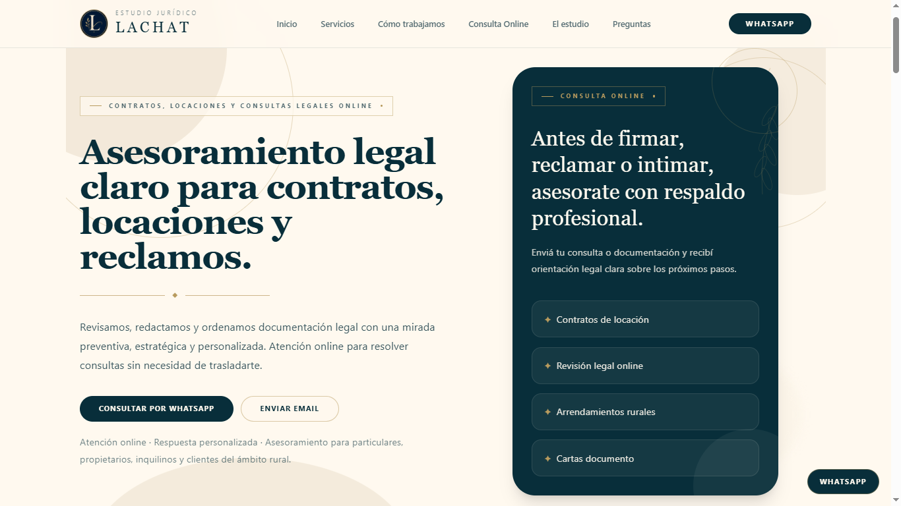

# Estudio Jurídico Lachat — Next.js Landing

<!-- Badges del Stack Tecnológico -->

<div align="center">


</div>

<br />

<!-- Imagen de previsualización centrada -->

<div align="center">

</div>

<br />

Landing page comercial para **Estudio Jurídico Lachat**, migrada desde Vite/React hacia **Next.js App Router**, con foco en SEO técnico, performance, accesibilidad, estructura escalable y conversión mediante formulario de contacto, WhatsApp y carga de documentación.

El sitio mantiene una estética **Boutique Legal Premium**: editorial, cálida, sobria y profesional, con identidad visual basada en azul petróleo, dorado editorial, fondos crema y tipografía serif para encabezados.

---
Landing page comercial para **Estudio Jurídico Lachat**, migrada desde Vite/React hacia **Next.js App Router**, con foco en SEO técnico, performance, accesibilidad, estructura escalable y conversión mediante formulario de contacto, WhatsApp y carga de documentación.

El sitio mantiene una estética **Boutique Legal Premium**: editorial, cálida, sobria y profesional, con identidad visual basada en azul petróleo, dorado editorial, fondos crema y tipografía serif para encabezados.

---

## Tabla de contenidos

- [Descripción](#descripción)
- [Estado del proyecto](#estado-del-proyecto)
- [Stack técnico](#stack-técnico)
- [Funcionalidades principales](#funcionalidades-principales)
- [Arquitectura](#arquitectura)
- [Design system](#design-system)
- [Variables de entorno](#variables-de-entorno)
- [Instalación local](#instalación-local)
- [Scripts disponibles](#scripts-disponibles)
- [Formulario de contacto](#formulario-de-contacto)
- [Supabase](#supabase)
- [SEO técnico](#seo-técnico)
- [Deploy en Vercel](#deploy-en-vercel)
- [Checklist antes de producción](#checklist-antes-de-producción)
- [Buenas prácticas aplicadas](#buenas-prácticas-aplicadas)
- [Autor](#autor)

---

## Descripción

Este proyecto es la migración a Next.js de la landing comercial del **Estudio Jurídico Lachat**.

El objetivo principal es mejorar:

- SEO técnico.
- Performance.
- Organización arquitectónica.
- Escalabilidad del código.
- Experiencia de usuario.
- Conversión mediante consultas legales online.

La landing está orientada a captar consultas sobre:

- Contratos.
- Locaciones urbanas.
- Arrendamientos rurales.
- Cartas documento.
- Reclamos e intimaciones.
- Consultas legales remotas.

---

## Estado del proyecto

Estado actual: **migración funcional completada y deploy inicial validado en Vercel**.

Validado:

- Landing funcional en Next.js.
- Build de producción correcto.
- Formulario sin archivo funcionando.
- Formulario con archivo funcionando.
- Inserción en Supabase.
- Carga de archivos en Supabase Storage.
- Automatización de email funcionando.
- Registro automático en Google Sheets funcionando.
- Deploy en Vercel funcionando.
- SEO base configurado con metadata, sitemap, robots y Open Graph image.

---

## Stack técnico

- **Next.js** con App Router.
- **TypeScript estricto**.
- **Tailwind CSS v4**.
- **Supabase**:
  - Database.
  - Storage.
  - RLS policies.
- **Vercel** para deploy.
- **Google Sheets** mediante automatización externa.
- **Resend / email automation** mediante flujo conectado al registro de consultas.

---

## Funcionalidades principales

- Landing responsive.
- Navbar sticky.
- Footer institucional.
- Logo real del estudio.
- Botón flotante de WhatsApp.
- Secciones dinámicas desde `src/data`.
- Formulario real de contacto.
- Carga de documentación adjunta.
- Honeypot anti-spam.
- Inserción de consultas en Supabase.
- Storage de archivos legales.
- Automatización hacia email y Google Sheets.
- SEO técnico para buscadores y redes sociales.

---

## Arquitectura

La estructura principal del proyecto sigue separación estricta de responsabilidades.

```txt
src/
├── app/
│   ├── favicon.ico
│   ├── globals.css
│   ├── layout.tsx
│   ├── page.tsx
│   ├── robots.ts
│   └── sitemap.ts
│
├── components/
│   ├── layout/
│   │   ├── Footer.tsx
│   │   └── Navbar.tsx
│   │
│   ├── sections/
│   │   ├── Approach.tsx
│   │   ├── CommonSituations.tsx
│   │   ├── ContactForm.tsx
│   │   ├── ContactSection.tsx
│   │   ├── FAQ.tsx
│   │   ├── Hero.tsx
│   │   ├── Process.tsx
│   │   └── Services.tsx
│   │
│   └── ui/
│       ├── Button.tsx
│       ├── Dividers.tsx
│       ├── FAQItem.tsx
│       ├── FloatingWhatsApp.tsx
│       ├── Label.tsx
│       ├── LeafSprig.tsx
│       ├── Logo.tsx
│       ├── OrganicDecor.tsx
│       └── ServiceCard.tsx
│
├── config/
│   ├── contact.ts
│   └── site.ts
│
├── constants/
│   └── contactForm.ts
│
├── data/
│   ├── approachItems.ts
│   ├── commonSituations.ts
│   ├── faqs.ts
│   ├── processSteps.ts
│   └── services.ts
│
├── lib/
│   └── supabaseClient.ts
│
└── utils/
    ├── contactFormValidation.ts
    └── fileHelpers.ts
````

---

## Design system

La identidad visual se basa en una estética **Boutique Legal Premium**.

### Colores principales

Definidos como tokens en Tailwind v4:

```css
--color-brand-dark: #082e3a;
--color-brand-gold: #b89b5e;
--color-brand-cream: #fff9ef;
--color-brand-surface: #fffaf0;
```

### Uso visual

* `brand-dark`: textos principales, fondos de contraste, botones primarios.
* `brand-gold`: acentos, divisores, detalles, estados focus/hover.
* `brand-cream`: fondo principal cálido.
* `brand-surface`: tarjetas, inputs y superficies claras.

### Tipografía

* Encabezados: serif editorial.
* Texto general: sans-serif limpia.
* Estilo general: mucho aire visual, contraste suave, ornamentos botánicos y divisores con rombos.

---

## Variables de entorno

El proyecto usa variables públicas de Supabase para operaciones permitidas por RLS desde el frontend.

Crear un archivo en la raíz:

```txt
.env.local
```

Con este contenido:

```bash
NEXT_PUBLIC_SUPABASE_URL="https://TU_PROJECT_ID.supabase.co"
NEXT_PUBLIC_SUPABASE_ANON_KEY="TU_SUPABASE_ANON_KEY"
```

No usar claves privadas ni service role en variables `NEXT_PUBLIC_*`.

Incorrecto:

```bash
NEXT_PUBLIC_SUPABASE_SERVICE_ROLE_KEY="..."
```

Correcto:

```bash
NEXT_PUBLIC_SUPABASE_ANON_KEY="..."
```

---

## Instalación local

Clonar el repositorio:

```bash
git clone https://github.com/Lucas-Epherra/estudio-lachat-next.git
```

Entrar al proyecto:

```bash
cd estudio-lachat-next
```

Instalar dependencias:

```bash
npm install
```

Crear `.env.local`:

```bash
NEXT_PUBLIC_SUPABASE_URL="https://TU_PROJECT_ID.supabase.co"
NEXT_PUBLIC_SUPABASE_ANON_KEY="TU_SUPABASE_ANON_KEY"
```

Levantar servidor local:

```bash
npm run dev
```

Abrir:

```txt
http://localhost:3000
```

---

## Scripts disponibles

### Desarrollo

```bash
npm run dev
```

Levanta el proyecto en modo desarrollo.

### Build de producción

```bash
npm run build
```

Compila el proyecto para producción.

### Servidor de producción local

```bash
npm run start
```

Ejecuta el build de producción localmente.

### Lint

```bash
npm run lint
```

Ejecuta validaciones de lint si el script está configurado en `package.json`.

---

## Formulario de contacto

El formulario está ubicado en:

```txt
src/components/sections/ContactForm.tsx
```

Es el único bloque principal que requiere `"use client"` porque gestiona:

* Estado del formulario.
* Submit.
* Archivos seleccionados.
* Validación.
* Feedback de éxito/error.
* Carga a Supabase Storage.
* Inserción en Supabase Database.

### Campos

* Nombre y apellido.
* Email.
* Teléfono / WhatsApp.
* Tipo de consulta.
* Mensaje.
* Documentación adjunta.
* Honeypot anti-spam.

### Tipos de consulta

Definidos en:

```txt
src/constants/contactForm.ts
```

```ts
export const CASE_TYPES = [
  "Contratos",
  "Locaciones",
  "Carta documento",
  "Arrendamientos rurales",
  "Reclamo / intimación",
  "Otra consulta",
] as const;
```

Estos valores deben coincidir con el `CHECK constraint` definido en Supabase para la columna `case_type`.

---

## Supabase

El proyecto usa Supabase para:

* Guardar consultas en la tabla `contact_requests`.
* Subir documentos al bucket `legal-documents`.
* Conservar rutas de archivos en `file_paths`.

### Tabla esperada

```txt
contact_requests
```

Columnas utilizadas:

```txt
submission_id
full_name
email
phone
case_type
message
has_files
file_paths
status
```

### Bucket esperado

```txt
legal-documents
```

Los archivos se guardan bajo la ruta:

```txt
consultas/{submissionId}/{index}-{fileName}
```

Ejemplo:

```txt
consultas/550e8400-e29b-41d4-a716-446655440000/1-contrato.pdf
```

Esta ruta debe coincidir con la policy RLS configurada en Supabase Storage.

### Restricciones de adjuntos

Definidas en:

```txt
src/constants/contactForm.ts
```

```ts
MAX_FILES: 3
MAX_FILE_SIZE_MB: 5
ACCEPTED_EXTENSIONS: [".pdf", ".jpg", ".jpeg", ".png", ".doc", ".docx"]
```

---

## SEO técnico

La configuración SEO global está centralizada en:

```txt
src/config/site.ts
```

Y se aplica desde:

```txt
src/app/layout.tsx
```

Incluye:

* Title.
* Description.
* Keywords.
* Canonical.
* Open Graph.
* Twitter Card.
* Favicon.
* Apple icon.
* Metadata base.

### Rutas SEO generadas

```txt
/robots.txt
/sitemap.xml
/og-lachat.png
```

Archivos relacionados:

```txt
src/app/robots.ts
src/app/sitemap.ts
public/og-lachat.png
```

---

## Deploy en Vercel

El proyecto está preparado para deploy en Vercel.

### Variables requeridas en Vercel

En:

```txt
Project → Settings → Environment Variables
```

Agregar:

```bash
NEXT_PUBLIC_SUPABASE_URL
NEXT_PUBLIC_SUPABASE_ANON_KEY
```

Scopes recomendados:

```txt
Production
Preview
```

### Configuración recomendada

```txt
Framework Preset: Next.js
Build Command: npm run build
Install Command: npm install
Output Directory: Default
```

### Dominio

Dominio final previsto:

```txt
https://www.estudiolachat.com.ar
```

Antes de apuntar el dominio real, validar:

* Deploy preview.
* Formulario sin archivo.
* Formulario con archivo.
* Email.
* Google Sheets.
* Supabase Storage.
* SEO routes.
* Mobile.

---

## Checklist antes de producción

Antes de conectar el dominio real:

```txt
[ ] npm run build correcto
[ ] Home carga correctamente
[ ] Logo carga en desktop y mobile
[ ] Navbar responsive correcto
[ ] Footer responsive correcto
[ ] Floating WhatsApp no tapa contenido crítico
[ ] Formulario sin archivo funciona
[ ] Formulario con archivo funciona
[ ] Registro aparece en Supabase
[ ] Archivo aparece en legal-documents/consultas
[ ] Email llega correctamente
[ ] Google Sheets se actualiza
[ ] /robots.txt funciona
[ ] /sitemap.xml funciona
[ ] /og-lachat.png funciona
[ ] Preview validado en mobile 320px
[ ] Preview validado en mobile 425px
[ ] Preview validado en desktop
```

---

## Buenas prácticas aplicadas

* Server Components por defecto.
* Client Component solo para formulario interactivo.
* TypeScript estricto.
* Interfaces y tipos explícitos.
* JSDoc en componentes y lógica relevante.
* Separación de datos y vista.
* Configuración centralizada.
* Diseño responsive.
* HTML semántico.
* Accesibilidad con labels, aria-labels y focus states.
* Honeypot anti-spam.
* Variables de entorno seguras.
* Rutas SEO nativas del App Router.
* Deploy preview antes de producción.

---

## Autor

Desarrollado por:

**Lucas Epherra**

Portfolio:

```txt
https://lucasepherra.com.ar/
```

---

## Licencia

Proyecto desarrollado para uso comercial del **Estudio Jurídico Lachat**.

No se recomienda reutilizar la identidad visual, textos comerciales, logo ni automatizaciones asociadas sin autorización.


